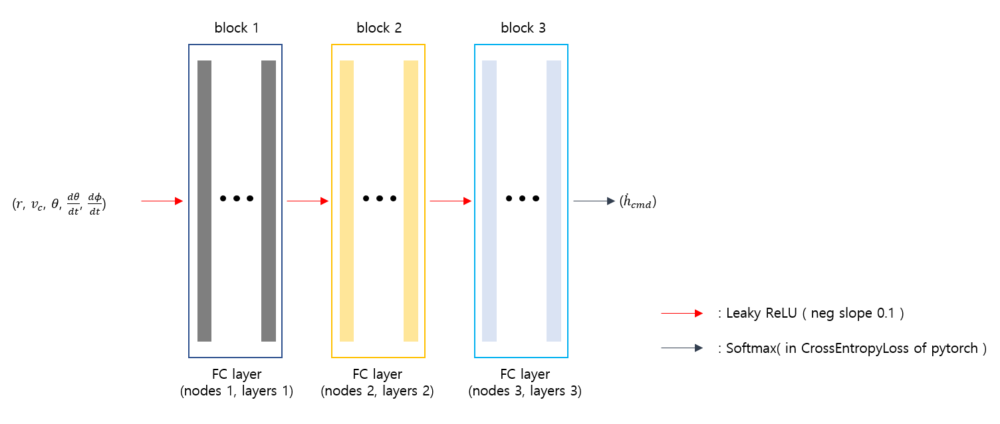

# Imitation_learning
 본 Repo는 항공기 충돌회피 보조시스템 학습을 위한 policy net의 구조를 실험하는 내용이다. 본 Repo는 항공기 회피를 위한 항공기 충돌 시뮬레이션 환경 구성과 이후 강화학습의 정책네트워크로써 사용될 네트워크를 모델링 하여 학습하는 과정을 포함한다. 강화학습을 이용한 최적화는 [Model_Optimization_Using_PPO](https://github.com/kun-woo-park/Model_Optimization_Using_PPO)에서, YOLOV4와 함께 Jetson Xavier 위에 융합 구현한 내용은 [YOLOV4_UDP_Jetson](https://github.com/kun-woo-park/YOLOV4_UDP_Jetson)에서 확인할 수 있다. [모방학습을 활용한 항공기 충돌회피 정책 네트워크 모델링.pdf](모방학습을%20활용한%20항공기%20충돌회피%20정책%20네트워크%20모델링.pdf) 에서 논문 내용을 확인 할 수 있다. 정리되지 않은 실험내용은 [Previous_experiments](https://github.com/aisl-khu/collision_avoidance/tree/master/Aircraft_avoidance_policy_net)에서 확인할 수 있다. (Github markdown 문서 특성상 Latex 문자를 이미지형태로 가져왔다.)

## Implement project
```bash
git clone https://github.com/kun-woo-park/Imitation_learning.git
cd Imitation_learning
sh train.sh
```
### 1. Project overview

#### Figure 1. Environment overview


항공기들의 충돌 시뮬레이션은 Figure 1.과 같이 진행된다. 회피기와 침입기는 반경 2000m의 원의 끝에서 해당 원의 중심으로 초속 200m로 접근한다. 침입기는 회피기의 경로에 대해 좌, 우 50도 범주 내의 각도로 접근하며, 경로의 다양화를 위해 접근각도에는 Gaussian random noise가 포함된다. 회피기의 출발고도는 1000m 상공이고, 침입기는 이를 기준으로 상, 하 200m의 범주 이내에서 접근한다. 항공기 기동은 뒤따르는 동역학을 따르도록 구현하였다. 동역학 구성의 단순화를 위해 항공기의 회피에 사용되는 기동명령은 상, 하, 유지기동의 총 3개의 명령으로 한정하였다. 항공기가 수직방향으로의 기동명령만을 주기 때문에, 항공기 옆면에서 봤을때의 힘(Force)와 속도(Velocity)를 분석하여 동역학을 구현하였다. 먼저 Figure 2.에서 항공기의 속도에 대한 벡터를 분석하였다.  은 항공기가 수평으로 진행하는 속도이고, 은 항공기가 수직으로 진행하는 속도(고도 변화율), 는 항공기의 속도이다. 여기서 지면과의 시야각을 (line of sight)라고 했을때 은 를 만족한다. Figure 3.는 항공기의 속도 변화(가속도)에 대한 분석이다. 항공기의 기동 명령은 기체를 기준으로 수직으로 작용하는 이고, 수직방향으로의 이동에 사용되는 가속도는 Figure 2. 에서 볼 수 있다시피, 로 계산 할 수 있다. 비행기의 운동에는 늘 중력이 작용하기 때문에 실제 수직방향의 총 가속도는, 수직방향의 기동명령에 의한 가속도 에서 중력가속도 를 뺀 값이 된다. Figure 4.은 앞서말한 벡터분석들을 통합하여, 항공기에 기동명령을 주었을 때 항공기가 실제처럼 약 1초정도의 반응 시간(기동을 변화시킬때 해당 기동명령에 동일하게 반응할때까지 걸리 시간)을 두도록 구현한 역학모델이다.

#### Figure 2. Analysis on velocity vector of aircraft 


#### Figure 3. Analysis on acceleration vector of aircraft


#### Figure 4. Dynamics of controling aircraft


회피를 판단하는 기준은 총 5가지의 feature에 대한 연산으로 진행할 수 있도록 하였다. 5개의 feature는 아래와 같다.

- r (): 회피기와 침입기의 상대거리
- vc (): 침입기의 접근속도(상대속도)
- los (): Line of sight
- daz (): Azimuth의 스텝 당 변화량
- dlos (): Los의 스텝 당 변화량

5개의 feature들로, 해당 진행경로를 유지했을때 상대기와의 예상 최소 수직거리(MDV, minimum distance of vertical)와 예상 최소 수평거리(MDH, minimum distance of horizontal)을 계산할 수 있었다. 여기에 기동을 푸는 조건을 위해 필요한 현재 침입기와의 고도차이(코드에선 dist_cruise로 표현하였다.)역시 계산 할 수 있었다.

#### Calculate MDV, MDH and dist_cruise


이 세가지 정보 (MDV, MDH and dist_cruise)로 회피 명령을 내릴지, 혹은 현재 경로를 유지할지를 매 순간마다 결정할 수 있는 닫힌 결정루프를(만약, 강화학습에 적용한다면 MDP를 기준으로 설계해야 하기 때문) 설계해야 했다. 설계한 결정루프의 구조는 아래와 같다. dist_sep는 항공기가 회피했다고 판단하는 최소 거리로 이 거리 이상을 벗어나야 회피했다고 판단한다(여기선 100m로 지정했다).

#### Figure 5. Command decision loop


이렇게 구현된 환경을 토대로 학습시키기 위해서는, 비행기가 어떤 상황의 어떤 순간에던 적용이 가능하도록, 데이터를 뽑을때 랜덤한 time step에서 랜덤하게 샘플을 추출할 필요가 있었다. 따라서 하나의 에피소드의 전체 time line 에서 랜덤한 time step 지점을 뽑아 샘플로 만들었다. 각 데이터 샘플은 네트워크의 입력으로 들어갈 5개의 feature (r, vc, los, das, dlos)와 그때 비행기에게 내려야할 고도변화 명령(hdot_cmd)로 구성되었다. 생성한 데이터는 train data 300000개, test data 90000개의 총 390000개의 데이터를 생성하였다

#### Network modeling
회피 기동을 학습하기에 가장 적합한 network의 구조를 찾기 위해, 먼저 network의 구조를 3개의 FC(Fully connected) layer로 구성된 block으로 구현하였다. 각 block은 node 개수와 layer 개수를 입력값으로 주면, 해당 입력값에 맞게 모델을 구현하도록 설계하였다. 

#### Figure 6. Network model with 3blocks



각 block의 node와 layer를 자동으로 입력받아 실험결과를 저장하도록 두개의 bash script를 작성하여 실행시켰다. 실험내용의 범주는 아래와 같다. 각 실험내용은 총 4회씩 진행되었다. 학습에 대한 hyper parameters는 위의 network model 이미지에 작성된 내용대로 진행하였다.

- Layer : [1, 1, 1] , [2, 2, 2]
- Node : [20-80(interval 20), 20-80(interval 20), 20-80(interval 20)]

결과 분석에는 아래의 총 3가지 요소에 대해 분석을 진행하였다.

- Minimum distance on all episode time steps (Mean of four models)
- Minimum distance on all episode time steps (Standard deviation of four models)
- Number of model parameters

회피 거리가 dist_sep에 가깝게 회피하는 것이 회피 명령을 덜 사용(연료를 덜 사용)하여 더 효율적이기 때문에 4개의 모델의 최소 접근거리에 대한 평균값이 낮을수록 좋은 모델이라고 판단했다. 또한 최소 접근거리의 편차가 높은것은 torch의 random seed마다 수렴이 달라진다는 의미이다. 이는 강화학습시 분산이 크게 작용하여 under fitting의 가능성이 있다고 판단하여, 최소 접근거리의 표준편차 역시 평가요소에 반영하였다. 모델의 파라미터는 학습시킨 모델을 Jetson Xavier라는 임베디드 컴퓨터에 올리는 것을 감안하여 작을수록 좋다고 판단하였다. 각각의 가중치를 0.8, 0.1, 0.1로 두어 점수로 환산하여 모델의 구조를 비교하였다.

### 2. Result

환산된 점수를 토대로 최종 모델은 node = [40, 20, 60], layer = [2, 2, 2] 이 되었다. 아래는 네트워크 층 수[1, 1, 1]과 [2, 2, 2]에 대한 노드별(20~80) 점수의 contour plot이다. 별(star)로 표시되어 있는 지점이 최종 채택된 네트워크이다. 여기서 x1, x2, x3는 각 첫번째, 두번째, 세번째 블록의 노드 수를 의미한다.

#### Figure 7. Contour plot of the model score for [1, 1, 1] layers

  

#### Figure 8. Contour plot of the model score for [2, 2, 2] layers(Including selected network, star marked)

  

#### Figure 9. Confusion matrix of selected model (Test set)


Figure 9. 는 최종 채택된 네트워크의 test set에 대한 confusion matrix이다. 회피 경로와 최소 접근거리에 대한 분포 등 상세 결과는 첨부된 링크의 Github repository에서 확인 할 수 있다.


추가적으로 train dataset의 크기에 따라 어느정도의 dataset만으로도 충분한 학습이 가능한지 확인하기 위해, dataset의 갯수를 다르게 하여 학습을 진행해보았다. 결과는 다음과 같다.

#### Accuracy by number of datas
 

